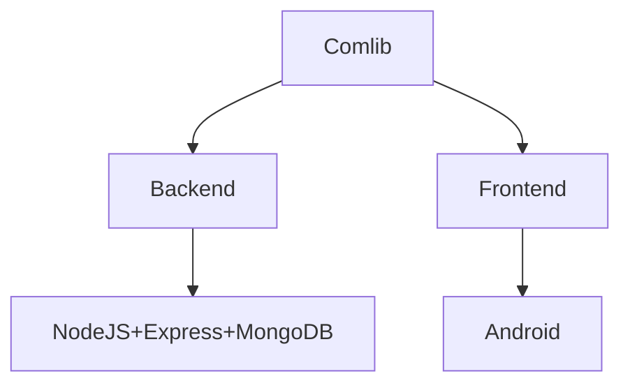

## Comlib (work in progress 👷 🛠️)

<p align = "center">

</p>

Comlib is a system that aims to complement your reading habits. You log on to the system track what you're reading, share reading materials with others and even set milestones.

#### Problem statement

The modern society requires individuals to stay constantly updated on various aspects of the world. The exchange of ideas, beliefs, and opinions is happening at a rapid pace. Young people need to be consistently aware of what is happening in the world around them.

Reading is one of the proven ways to enhance the exchange of information, especially in a world where information is ubiquitous. Establishing a strong foundation in the principles that shape our lives is an effective way to promote this exchange. But how do we ensure that we regularly update ourselves without the need to purchase books every time, which can be both expensive and time-consuming?

Enter **ComLib**. We strive to simplify the process of book exchange for readers, effectively fostering the development of a reading culture.

#### Tech stack



##### 

#### Android development

Comlib attempts use of the latest libraries and tools:

- Entirely written in [Kotlin](https://kotlinlang.org/)

- Ui is completely written in [Jetpack compose](https://developer.android.com/jetpack/compose)

- Uses [Hilt](https://developer.android.com/training/dependency-injection/hilt-android) for Dependency Injection.

- Uses [Recommended architecture](https://developer.android.com/topic/architecture/recommendations) and Architectural components - Room, Lifecycle, Navigation throughout.

### Modules

<table>
<thead>
<tr>
    <th>Module</th>
    <th>Purpose</th>
</tr>
</thead>
<tbody>
<tr>
    <td>:app</td>
    <td>Serves as the entry point</td>
</tr>
<tr>
    <td>:core:designsystem</td>
    <td>Contains all things design</td>
</tr>
<tr>
    <td>:core:util</td>
    <td>Contains all utilities eg String extension functions</td>
</tr>
<tr>
    <td>:core:ui</td>
    <td>Contains common ui components</td>
</tr>
<tr>
    <td>:core:auth</td>
    <td>Contains all logic for authentication flow</td>
</tr>
<tr>
    <td>:core:common</td>
    <td>Contains logic that is shared commonly in more than one module</td>
</tr>
<tr>
    <td>:core:data</td>
    <td>Combines all the data from the various sources</td>
</tr>
<tr>
    <td>:core:database</td>
    <td>Contains database implementations</td>
</tr>
<tr>
    <td>:core:data-test</td>
    <td>Contains all testing logic for data module</td>
</tr>
<tr>
    <td>:core:datastore</td>
    <td>Contains data from the datastore prefs</td>
</tr>
<tr>
    <td>:core:testing</td>
    <td>Contains testing logic that is common in more several modules</td>
</tr>
<tr>
    <td>:core:local</td>
    <td>Contains data from disk eg. usage statistics</td>
</tr>
<tr>
    <td>:core:model</td>
    <td>Contains all data model definitions</td>
</tr>
<tr>
    <td>:core:network</td>
    <td>Contains logic for making API interface definitions.</td>
</tr>
<tr>
    <td>:core:domain</td>
    <td>Contains use case implementation</td>
</tr>
<tr>
    <td>:feauture:auth</td>
    <td>Auth ui logic</td>
</tr>
<tr>
    <td>:feature:add_book</td>
    <td>UI logic for adding new books to the library</td>
</tr>
<tr>
    <td>:feature:book_detail</td>
    <td>Book detail ui</td>
</tr>
<tr>
    <td>:feature:books</td>
    <td>List of available books</td>
</tr>
<tr>
    <td>:feature:genre_setup</td>
    <td>Preferred genres selection</td>
</tr>
<tr>
    <td>:feature:my_books</td>
    <td>Books belonging to current user</td>
</tr>
<tr>
    <td>:feature:profile</td>
    <td>User profile and setting information</td>
</tr>
<tr>
    <td>:feature:streak</td>
    <td>UI logic for creating a new reading streak.</td>
</tr>
</tbody>
</table>

#### Development setup

You need to be using the latest Android studio (Hedgehog and newer) to build and run the app.

#### Code style

Comlib employs the use of [Gradle conventional plugins](https://medium.com/@yudistirosaputro/gradle-convention-plugins-a-powerful-tool-for-reusing-build-configuration-ba2b250d9063#:~:text=Gradle%20convention%20plugins%20are%20a,build%20management%20and%20increase%20efficiency.) for faster and efficient build times.

### Linting

ComLib uses [Spotless](https://github.com/diffplug/spotless) and [Ktlint](https://github.com/JLLeitschuh/ktlint-gradle) is used to catch bugs before they propagate in production.

#### Contributing

If you've found an error in this sample please feel free to file an issue.

Patches are encouraged and maybe submitted by forking this project and submitting a pull request.

The app follows this [design](https://www.figma.com/file/CaFRSEBwwKLT5T3T2Ej1Ac/Comlib?type=design&node-id=0-1&mode=design&t=otpudqSVQV0603CL-0).

#### License

```
Copyright 2023 Denis Githuku

Licensed under the Apache License, Version 2.0 (the "License");
you may not use this file except in compliance with the License.
You may obtain a copy of the License at

https://www.apache.org/licenses/LICENSE-2.0

Unless required by applicable law or agreed to in writing, software
distributed under the License is distributed on an "AS IS" BASIS,
WITHOUT WARRANTIES OR CONDITIONS OF ANY KIND, either express or implied.
See the License for the specific language governing permissions and
limitations under the License.
```

### Planned

- [ ] Streak state widget

- [ ] Ask Gemini - summary and book plot.

- [ ] Port to multiplatform

- [ ] Periodic reminders
